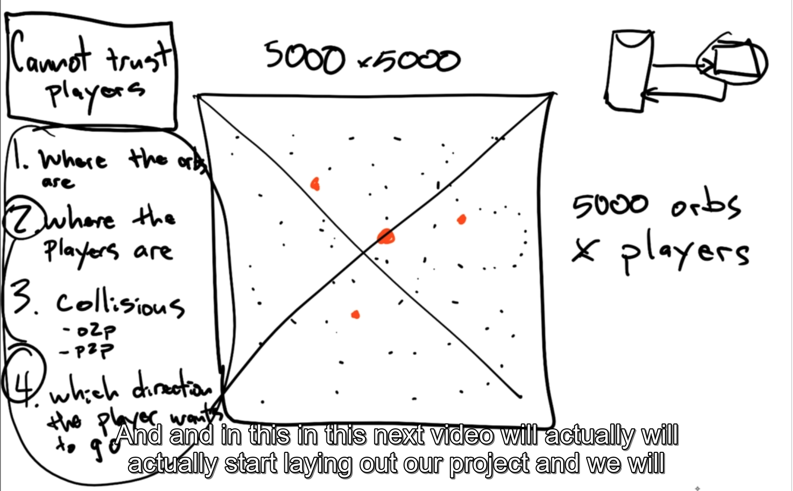
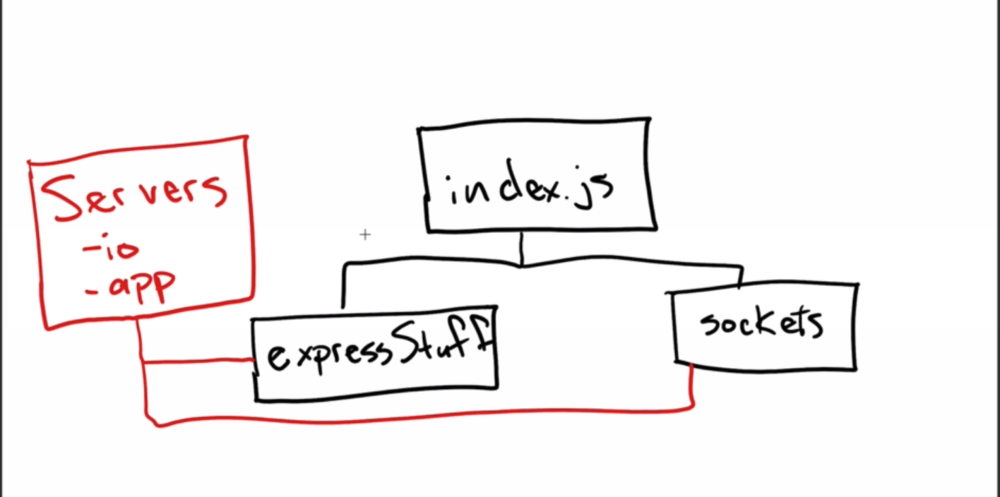

# Agar
- Board: 5000 x 5000
- 5000 orbs
- x player

## Concern
1/ Where the orbs are
2/ Where the players are
3/ Collisions
- oZp
- pZp
4/ Which directio the player wqant to go

# Screenshots
## App Oveview

## Code logic

# Mis
- [Node module cache](https://nodejs.org/api/modules.html#caching)