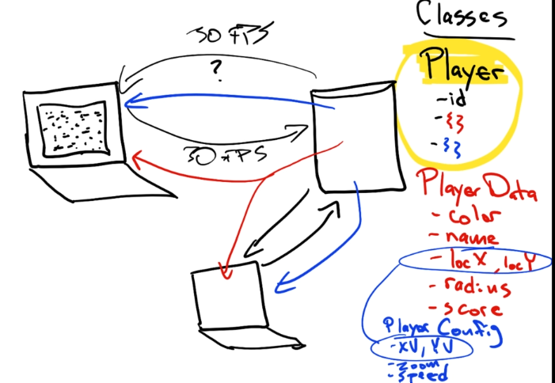
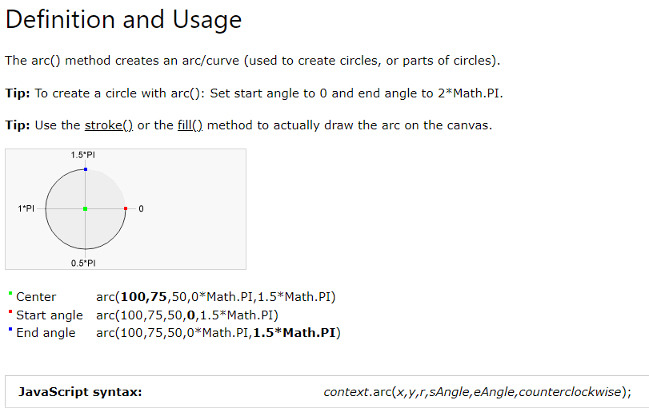
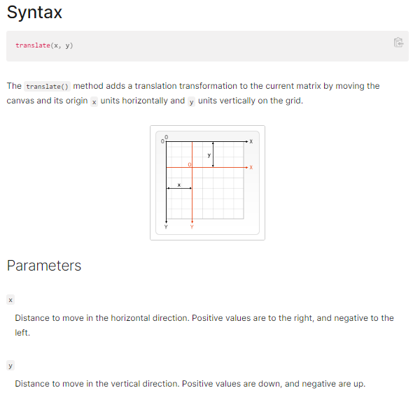

# Agar
- Board: 5000 x 5000
- 5000 orbs
- x player

## Concern
1/ Where the orbs are
2/ Where the players are
3/ Collisions
- oZp
- pZp
4/ Which directio the player wqant to go

## Objects
### Player
{
    id,
    // this is where all the data that EVERONE needs to know about
    data: PlayerData {
        color,
        name,
        locX,
        locY,
        radius,
        score
    },
    // this is where all the data is that no other player needs to known about
    config: PlayerConfig {
        xV,
        yV,
        zoom,
        speed
    }
}

# Screenshots
## App Oveview

## Code logic

# Mis
- [Node module cache](https://nodejs.org/api/modules.html#caching)
- [Canvas Arc](https://www.w3schools.com/tags/canvas_arc.asp)

- [Canvas Translate](https://developer.mozilla.org/en-US/docs/Web/API/CanvasRenderingContext2D/translate)

- [canvas.setTransform](https://developer.mozilla.org/en-US/docs/Web/API/CanvasRenderingContext2D/setTransform)
