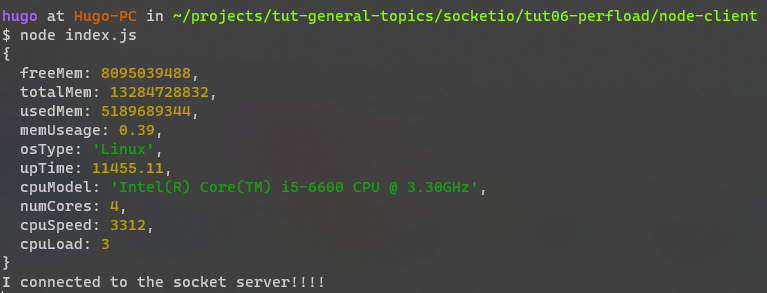
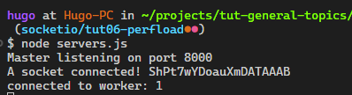

# PROJECT: PERFLOAD
## Overview

Server {
    redis,
    master-node,
    node-workers:[
        worker1,
        worker2,
        worker3,
    ],
    mongo
}

Node-client {
    send: fn(pData), // performance data
}

### Problems
- how to scale? How to manage dozen of connection?
- Run socket.io server in available threads (workers)
- There's a master-node, a manager, control all of the individual workers and it also send jobs to these who will process that jobs
- Node-clients will go through a port, reach to master-node.
- Issue 1: make sure when a node-client get back. It must go to the same worker.
    - Use socket.io-redis as an apdapter

## Server
Serve for both clients
Req:
- socket.io
- socket.io-redis
- farmhash
- node 17x

## How it work
### Diagram
Worker {
    onExit: fn(),
    onMessage: fn(message, connection), // listen message from Master
    server: ExpressServer {
        port, // default is 0, not expose to outsite
    }, // HttpServer
    socketIoServer: SocketIoServer,

}

Master {
    workers: Worker [],
    getWorkerIndex: fn(IpAddress), // a hash fn return index of a worker base on IP Address
    server: TcpServer {
        port, // tpc listen port
    },
    onConnection: fn(connection: net.Socket),
}

### Cluster Master
- Create and store all workers
    Nr of workers are spawned based on nr of cpu
    When a worker died, a new one should be spawned (listen event worker.onExit)
- Cluster will open a tcp connection port. This port will face the internet
    Use NET module (Express will use HTTP module)
- We received a connection and need to pass it to the appropriate worker
    Master.onConnection

### Worker
- Don't expose to ouside
- Wait a connection passed from the Master
    onMessage

- When a connection come
    verify message come from Master
    pass connection to worker.server

### Connecting node-client to the socket server

### Test cluster node
- Start
`$ node clusterTest.js           
Primary 5797 is running
Worker 5805 started
Worker 5804 started
Worker 5811 started
Worker 5813 started`

- Acces localhost:8000, refresh many times
`
Worker 5805 has been called!!!
Worker 5805 has been called!!!
Worker 5805 has been called!!!
Worker 5804 has been called!!!
Worker 5804 has been called!!!
Worker 5804 has been called!!!
`

## Node-client
The node program that captures local performance data
Req:
- framhash
- socket.io-client

### Task
1/ Get performance data
- CPU load (current)
- Memory Usage
    - free
    - total
- OS type
- uptime
- CPU info
    - type
    - number of cores
    - clock speed

## React-client

## Redis Server
- Use redis for docker
- Storing state of node's workers

### How to
1/ Connect via redis-cli
- `$docker exec -it [container-id] sh`
- `redis-cli`

# Run with docker
- Start Server and React-Client
`docker compose up redis server react-client`

- Start Node-client, default has 3 instance
`docker compose up node-client`

- React client run at port 8001
- Server run at port 8000

# Misc
- [Redis.io](https://redis.io/docs/getting-started/)
- [Node Cluster](https://nodejs.org/api/cluster.html)
- [Socket.io Load Balancing](https://socket.io/docs/v4/using-multiple-nodes/)
- [Socket Redis Adapter](https://socket.io/docs/v4/redis-adapter/)
- [Node Os](https://nodejs.org/api/os.html)