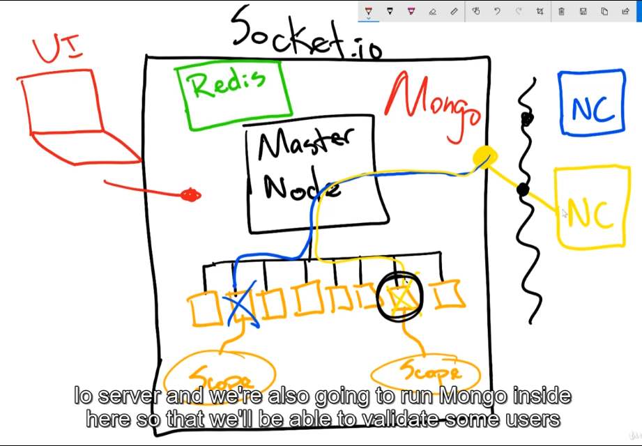
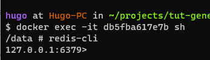

# PROJECT: PERFLOAD
## Overview

Server {
    redis,
    master-node,
    node-workers:[
        worker1,
        worker2,
        worker3,
    ],
    mongo
}

Node-client {
    send: fn(pData), // performance data
}

### Problems
- how to scale? How to manage dozen of connection?
- Run socket.io server in available threads (workers)
- There's a master-node, a manager, control all of the individual workers and it also send jobs to these who will process that jobs
- Node-clients will go through a port, reach to master-node.
- Issue 1: make sure when a node-client get back. It must go to the same worker.
    - Use socket.io-redis as an apdapter

## Server
Serve for both clients
Req:
- socket.io
- socket.io-redis
- farmhash

## Node-client
The node program that captures local performance data
Req:
- framhash
- socket.io-client

## React-client

## Redis Server
- Use redis for docker
- Storing state of node's workers

### How to
1/ Connect via redis-cli
- `$docker exec -it [container-id] sh`
- `redis-cli`

# Misc
- [Redis.io](https://redis.io/docs/getting-started/)
- [Node Cluster](https://nodejs.org/api/cluster.html)
- [Socker.io Load Balancing](https://socket.io/docs/v4/using-multiple-nodes/)
